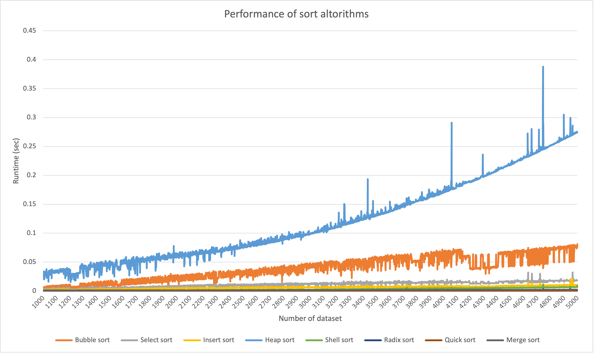

# Sort algorithms 

## Implementation 

* implementation popular sort algorithms in C code
  * Bubble sort
  * Select sort
  * Insert sort
  * Heap sort
  * Shell sort
  * Radix sort
  * Quick sort
  * Merge sort

## Benchmark of sort algorithms that i made

* Enviroment
  * Device: MacBook Air
  * CPU: Apple M1 chip
  * Memory: 16 GB

* Data Set
  * Randomized Integer data
  * Number of dataset : 1000 ~ 5000

* Graph of my sort algorithm

## Result

* As number of dataset increment, graph was linearly rised.
* Rise rate of bubble sort chart is higher than other algorithms.
* exception: my heap sort algorithms is strange
  * Heap sort algorithm time complexity is O(nlogn)
  * my heap sort runtime is so bad
  * Rise rate of chart data is highest.
  
ToDo List

- [ ] Check heap sort algorithm.